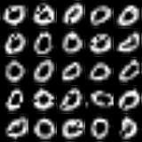
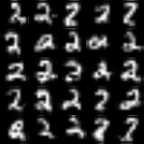
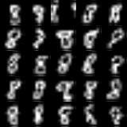

# Intro

This repository is made as supplementary material for a tutorial. 
The tutorial shows how to use Recurrent Neural Nets as generative 
models. Specifically, it shows how such a model can be used to 
sample images and classify them. For more information, see the 
file "tutorial.md" in the repository.

This repository contains pre-trained generative models. The 
"trained/minst_models" folder contains all 10 models for each of 
MNIST digits. Each pre-trained model was trained on MNIST training 
data for 12 epochs using "Adam" optimizer with a standard set of 
hyperparameters and a batch size of 32 examples. Cross-entropy was 
used as a loss function.

Here are a few examples of generated digits:





# Installing and preparing the environment
Clone the repository,
```
git clone https://github.com/X-rayLaser/generative-rnn.git
```
switch to the project's directory,
```
cd generative-rnn
```

create a virtual environment for Python and activate it,
```
which python3
/usr/bin/python3
```
```
virtualenv --python='/usr/bin/python3' venv
. venv/bin/activate
```

finally, install dependencies with pip
```
pip install -r requirements.txt
```

# Usage
Generate images of a digit "8"
```
python generate_mnist.py --digit=8
```

Estimate classification accuracy on 500 MNIST test examples
```
python classification.py --num_images=500
```

Train a model on a digit "8" using 200 MNIST images for 100 epochs
```
python train_mnist.py --digit=8 --num_images=200 --epochs=100
```

Train all 10 models, one for each digit for 10 epochs on 1000 images
```
python train_mnist.py --all_digits=True --num_images=1000 --epochs=10
```

# License
This software is licensed under MIT license (see LICENSE).

## Third party libraries licenses
The software uses third party libraries that are distributed under 
their own terms (see LICENSE-3RD-PARTY).
