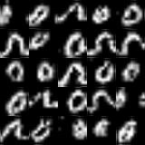
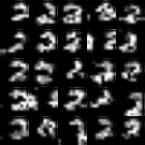
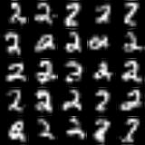

# Recurrent neural nets as generative models

In this tutorial, I am going to demonstrate how to use Recurrent 
Neural Nets (RNNs) to generate images with the help of Keras 
framework. Specifically, we are going to treat each image as a 
sequence of pixel intensities. We are going to train RNNs to 
predict the next pixel given all the preceding ones. After the 
training is complete, we will be able to sample newish images 
from this network. As a bonus, we will apply the model for 
an image classification task.

To save computational resources, I will concentrate on using 
MNIST and CIFAR-10 datasets.

## Prerequisites
First, we need to set up the environment. We create a new folder for
the project, open a terminal and set the current working directory to be
that project's directory
```
cd /path/to/your/project
```

We are going to structure our project in the following way.
```
project\
  generated\
    img1.jpg
    img2.jpg
  trained\
    mnist_models\
      mnist-0.h5
      mnist-1.h5
      mnist-2.h5
      ...
      mnist-9.h5
    cifar_models\
      cifar-0.h5
      cifar-1.h5
      cifar-2.h5
      ...
      cifar-9.h5
  generate.py
  train_mnist.py
  train_cifar.py
  requirements.txt
```
Scripts train_mnist.py and train_cifar will be used to train RNN on 
MNIST and CIFAR-10 datasets respectively. Script "generate.py" will 
generate (hopefully) novel images. "trained" folder will contain all 
trained models, whereas "generated" folder will store all images 
generated by those models. Finally, "requirements.txt" will list 
all Python libraries that we want to install. Let's create all these 
files and folders.
```
mkdir generated
mkdir trained
mkdir trained/mnist_models
mkdir trained/cifar_models
touch generate.py
touch train_mnist.py
touch train_cifar.py
touch requirements.txt
```

Now we create a virtual environment for Python and activate it
```
which python3
/usr/bin/python3
```
```
virtualenv --python='/usr/bin/python3' venv
```

```
. venv/bin/activate
```

Next, in the "requirements.txt", we list the following project 
dependencies
```
numpy
tensorflow<2.0
Keras
Pillow
scikit-image
scikit-learn
```

Finally, we install all the dependencies using the following command
```
pip install -r requirements.txt
```

Fortunately, we do not need to download datasets ourselves. Both 
datasets for our purposes are provided by Keras.


## Building RNN for generating MNIST images

### What is a generative model?
Very briefly, the generative model attempts to learn the conditional 
probability of x given y. In the context of image classification, 
this translates to calculating the probability of a particular 
sequence of pixel intensities given that this is an image of a digit 
"9". After the probability distribution is obtained, we can use a 
Bayes Rule to calculate the probability of y given x.
What makes generative models interesting is that they can be used 
to generate examples. Among other things, this allows the ML 
practitioner to see what their models actually learn.

As a reminder, the conditional probability of x given y can be 
expressed using the Law Of Total Probability. An important note. 
If we knew that there is no correlation among any elements of a 
feature vector, then we would only need to know the marginal 
probabilities for each element of x. For images, this 
assumption is wrong because nearby pixels are clearly correlated.

In this tutorial, we use a model based on RNN to find those 
probabilities. Specifically, the model will capture the 
conditional probability distribution of pixel intensity value 
given previously encountered intensities.

### Model architecture
Now we will begin implementing an RNN model.
As a quick reminder, here is how RNNs work. A typical RNN inputs 
a vector and produces another vector as an output. The output 
depends not only on the current input but on all the previous 
inputs. Note that input and output vectors do not need to be of 
the same length.

Depending on the problem at hand, one might add an additional 
layer on top of the RNN layer. One would add a linear layer 
(that is a layer without activation) or "RELU" layer if one 
wishes to perform regression. Whereas the softmax layer is 
used for a classification task.

Our model will be relatively shallow. It will only include a 
Gated Recurrent Layer (GRU) followed by a fully-connected layer 
with a softmax activation. 
It will receive a sequence of vectors with one-hot encoding as 
input and output a sequence of predictions. That is we choose an 
architecture that produces an output vector for each input vector 
in the sequence. GRU layer will have 256 units for representing 
the state. Last fully-connected layer will output a sequence of 
Probability Mass Functions over possible values of pixel intensities.

Note that for this problem input vectors and output vectors must 
have the same length. The length of vectors will depend on the 
maximum intensity parameter that we will specify later. 
Concretely, if maximum intensity equals to 3, then there are 4 
different levels such as 0, 1, 2 and 3. Therefore, one-hot 
encoding vectors will be of length 4.

Let's write a function that creates this model and creatively 
name it "create_model". It will have one parameter, specifying 
the length of vectors in the sequence.
```
def create_model(one_hot_len):
    model = Sequential()

    model.add(
        GRU(units=256, input_shape=(None, one_hot_len), return_sequences=True)
    )
    model.add(TimeDistributed(Dense(units=one_hot_len)))
    model.add(Activation(activation='softmax'))

    return model
```


A few remarks here. First, to output predictions for every 
element in the input sequence, the "return_sequences" option 
for GRU initializer is set to True. Second, to apply a dense 
layer to each output of the GRU layer, we wrap it in 
TimeDistributed layer. Finally, notice how input_shape parameter 
is used. "None" indicates that we'd like our model to process 
sequences of any size.

### Plan of attack
The work can be split into 3 steps: pre-processing, training 
and inference/sampling.

**Pre-processing**

First, we are going to shrink images to a manageable size and 
quantize their intensities. This will both speed up the learning 
process and increase prediction accuracy.
Next, we will unroll all images into 1-dimensional vectors of 
the same size. After that, 
we will convert those vectors into sequences of one-hot encoded 
vectors. For instance, if there are 4 possible values for pixel 
intensity, then value 2 will be represented as a vector 
[0, 0, 1, 0]T. 

**Training**

The objective of the model is to output probability distribution 
over the next element given the prefix (and the prefix can be of 
arbitrary length). The question is how to prepare training 
examples for the model to learn. There is more than one way to 
do this. For instance, one could create training data by getting 
all possible pairs of prefixes and targets per sequence. E.g. 
the sequence "word" would generate examples as follows 
("start of input", "w"),
("w", "o"), ("wo", "r"), ("wor", "d"), ("word", "end of input"). 
Note that the target consists of only one element, therefore the 
neural net has to be designed to only output a single prediction 
for any input sequence.

Another way is to leave all input sequences as they are and 
produce output sequences by shifting input sequences by one to 
the left. In other words, output sequences equal to input 
sequences without the first element. However, because both 
sequences need to be of the same length, the output sequence 
should include the additional element at the end. This type of 
element is called sentinel. With this method targets become 
sequences of the same length as the input sequences. The neural 
net has to be designed accordingly to accommodate this.

Any of these two approaches can be used to convert images into 
training pairs of sequences (x, y).

After examples are created, training is performed in a usual
supervised manner.

**Sampling**


**Inference**

Once we train the model, it can be used to classify the image. 
The classification consists of 3 ingredients.

The first ingredient 
involves finding the prior (unconditional) probability 
distribution over image classes. In practice, those probabilities 
can be interpreted as fractions of all images associated with a 
given class. Note that MNIST dataset is very well balanced and 
the (unconditional) probability to get an image with any digit 
is close to 1/10. In fact, we do not need priors at all for 
datasets like 
this. However, it is important to account for priors in more 
skewed cases.

Next ingredient involves computing the conditional probability 
of an image given y, for all y in 0,1,2...,9, where y is a 
candidate for a correct class. This probability can be calculated 
using the law of total probability and with the help of the RNN model.

The final ingredient is a Bayes Rule. The Bayes Rule can be 
used to calculate the posterior distribution of y given x. 
The classification problem reduces to finding y that maximizes 
the posterior probability.
If we are only interested in classification rather than 
probability estimates, there is an additional short cut that 
we can take. Namely, we can get rid of the denominator in the 
Bayes Rule formula and work only with the numerator.

### Implementing pre-processing subroutine
We keep adding functions to the "util.py" file. First, we 
create a "shrink" function.

```
def shrink(im, size):
    return img_as_ubyte(transform.resize(im, (size, size)))
```

It takes an image represented as a Numpy array with 2 dimensions 
and a target size of the image. It returns the image shrunk to 
the target size.

Second, we create a "shrink_all" function.
```
def shrink_all(x, size):
    resized = []
    for i in range(len(x)):
        im = shrink(x[i], size)
        resized.append(im)

    return np.array(resized)
```
It is similar to "shrink" function we just implemented. The only 
difference is that it takes and returns a collection of images.

Lastly, we create a function "pre_process".
```
def pre_process(images):
    import config

    images = shrink_all(images, config.target_size)
    images = np.array(np.round(images / config.factor), dtype=np.uint8)

    h, w = images[0].shape
    m = len(images)

    xs = to_categorical(images, num_classes=config.num_classes).reshape(
        -1, h ** 2, config.num_classes
    )

    xs = np.hstack(
        (np.zeros((m, 1, config.num_classes)), xs[:, 0:, :])
    )

    return xs
```

The function takes a Numpy array of images and returns a sequence 
of one-hot vector representations.

### Implementing training subroutine
Let's create a function train_model in the util.py file. 
This function will create a Keras model, fit it on the data and 
return it back to the caller.

The function has a few parameters. 
"xs" represents the Numpy array of pixel sequences with shape 
(number of images, sequence length, maximum intensity + 1). 
"num_classes" represents the size of the one-hot encoded vectors 
in the sequence (it equals to maximum intensity + 1). "batch_size" 
controls the number of examples in the batch for a Gradient 
Descent algorithm. Finally, "epochs" controls the number of 
training epochs.
```
def train_model(xs, num_classes, batch_size=32, epochs=50):
    model = create_model(num_classes)

    m = len(xs)

    ys = np.hstack(
        (xs[:, 1:, :], np.zeros((m, 1, num_classes)))
    )

    model.compile(optimizer='adam', loss='categorical_crossentropy',
                  metrics=['accuracy'])
    model.summary()

    model.fit(xs, ys, batch_size=batch_size, epochs=epochs)
    return model
```
The function starts with creating a model. It then prepends a zero 
vector to every sequence in "xs". Then it creates a batch of output 
sequences by shifting all input sequences by one element. It 
additionally adds a zero vector serving as a sentinel to every 
output sequence. Finally, it fits a model using an advanced 
optimizer called Adaptive Momentum (or Adam). Because the output 
is a categorical variable we use the cross-entropy loss.

### Implementing classification
Now it's time to write a function that performs classification 
of a batch of images into K = 10 classes. The function name is 
"classify". It takes 2 parameters: a path to the directory 
containing generative models for each digit, and a Numpy array 
of images of shape (number of images, height, width). The function 
returns an array of class predictions, one class per image.

```
def classify(models_dir, images):
    xs_extra = pre_process(images)
    xs = xs_extra[:, 1:, :]

    pixels = np.array(np.argmax(xs, axis=2), dtype=np.uint32)

    m, Tx, n = xs.shape
    K = 10

    image_indices = np.array([[i] * Tx for i in range(m)], dtype=np.uint32)
    sequence_indices = np.zeros((m, Tx), dtype=np.uint32)
    sequence_indices[:] = np.arange(Tx)

    prob_x = np.zeros((K, m))

    for k in range(K):
        path = os.path.join(models_dir, 'model_{}.h5'.format(k))
        model = load_model(path)

        pmf_seqs = model.predict(xs_extra)

        probabilities = pmf_seqs[image_indices, sequence_indices, pixels]

        prob_x[k] = np.prod(probabilities, axis=1)

    return np.argmax(prob_x, axis=0)
```

This function makes heavy use of vectorization to optimize 
computation, therefore it is harder to read. First, the function 
pre-processes the images and turns them into sequences of one-hot 
vectors. Then it prepends each sequence with zero vector for the 
reasons explained earlier. Then, it creates 2 arrays of indices 
and initializes array for storing a matrix of likelihoods. A kth 
row of the matrix contains likelihoods of each image under the 
assumption that the image belongs to class k.

The code in the loop may seem especially difficult to understand. 
Basically, it computes the conditional probability of a certain 
pixel in the image given its prefix for all possible prefix 
length. Then those probabilities are multiplied to estimate the 
likelihood of the image if it came from class k. This 
vectorized implementation allows computing likelihoods of 
all images at once. Once the function computes likelihoods 
using all K models, for each image it picks a class for which 
the likelihood is the highest.

### Implementing sampling
Let's implement the "sample" function. It takes 3 parameters: 
model, image_size and num_classes.

```
def sample(model, image_size, num_classes):
    pixels = np.zeros((image_size ** 2, 1), dtype=np.uint8)
    for i in range(1, image_size ** 2):
        prefix = to_categorical(
            pixels[:i].reshape(1, i), num_classes=num_classes
        ).reshape(1, i, num_classes)

        probs = model.predict(prefix)[0][-1]

        indices = list(range(num_classes))
        pixels[i] = np.random.choice(indices, p=probs)

    return pixels
```

We start by initializing a Numpy array of shape 
(image_size * image_size, 1) and fill it with zeros. Then we 
use the intensity of the first pixel (which is zero), turn it 
into a sequence consisting of one-hot vector, feed it into our 
model and get probability distribution over the next pixel 
intensity. Then we randomly sample the intensity of the next 
pixel according to the probability distribution we just got. 
This sampled integer value gets stored in the array.

Then, we use the first 2 predicted pixels to predict the next 
pixel. Then we use the first 3 predicted pixels to predict 
4th pixel. We repeat this process to predict all the 
remaining pixels and return the array.

### Final touches
Now all that is left to do is to write a code that calls the 
functions implemented earlier to train the model, classify 
images and sample digits.

Open "train_mnist.py" file in the editor. First, we import 
the necessary modules at the top of the file. 
Then we write a function "train".
The function loads the MNIST dataset. Then it takes a subset 
of images with the digit. Then it turns images into 
sequences, trains the model on those sequences and saves it 
in the file.
We also write additional boilerplate code to allows us to 
execute the script from the command line and pass arguments.

```
from keras.datasets import mnist
import config
from util import train_model, pre_process


def train(digit=0, num_images=100, epochs=50):
    (x_train, y_train), _ = mnist.load_data()

    x_train = x_train[(y_train == digit)]

    x_train = x_train[:num_images]

    xs = pre_process(x_train)

    model = train_model(xs, config.num_classes, epochs=epochs)

    model.save('trained/mnist_models/model_{}.h5'.format(digit))


if __name__ == '__main__':
    import argparse

    parser = argparse.ArgumentParser()
    parser.add_argument('--digit', type=int, default=0)
    parser.add_argument('--num_images', type=int, default=100)
    parser.add_argument('--epochs', type=int, default=50)
    parser.add_argument('--all_digits', type=bool, default=False)

    args = parser.parse_args()

    if args.all_digits:
        for i in range(10):
            train(digit=i, num_images=args.num_images, epochs=args.epochs)
            print('Model for digit {} is finished'.format(i))
    else:
        train(digit=args.digit, num_images=args.num_images, epochs=args.epochs)
```

Now switch to the "generate_mnist.py" file in the editor. 
Again, we import all of the required modules. We now implement a 
function "generate". The function draws a grid of sampled 
images containing a particular digit and shows using Pillow library.

To create each image, this function calls the "sample" function 
that we wrote earlier. The resulting image pixels are multiplied 
by a certain factor to bring pixel intensities back to the 0-255 
range. Finally, the array is reshaped, converted into an actual 
image and added to the grid. Once again, we add a little more 
code to conveniently run the script from the command line.

```
from util import sample, shrink
from keras.models import load_model
from keras.preprocessing.image import array_to_img
import config
import numpy as np
from PIL import ImageDraw, Image


def generate(digit=0, output_size=32, grid_size=5):
    model = load_model('trained/mnist_models/model_{}.h5'.format(digit))

    a = np.zeros((output_size * grid_size, output_size * grid_size),
                 dtype=np.uint8)

    im = Image.fromarray(a, mode='L')

    canvas = ImageDraw.ImageDraw(im)

    for i in range(grid_size):
        for j in range(grid_size):
            pixels = sample(model, config.target_size, config.num_classes)

            a = np.array(pixels * config.factor, dtype=np.uint8)

            a = a.reshape((config.target_size, config.target_size, 1))
            image = array_to_img(shrink(a, size=output_size))
            canvas.bitmap((j * output_size, i * output_size), image, fill=255)

    im.show()


if __name__ == '__main__':
    import argparse

    parser = argparse.ArgumentParser()
    parser.add_argument('--digit', type=int, default=0)
    args = parser.parse_args()

    generate(digit=args.digit)
```

Finally, switch to the "classification.py" file. Import the 
necessary modules and implement the function "estimate_accuracy". 
As its name suggests, the function estimates classification 
accuracy of the ML pipeline on MNIST test dataset. In our case, 
we need the whole fleet of models, one for each digit.

This is the easiest one. The function loads MNIST test data 
and calls the "classify" function. It then compares the vector 
of predictions with a vector of ground true classes and computes 
the fraction of correctly classified images. And once again, 
there is a simple boilerplate code to allow users to call the 
code from the command line.

```
import numpy as np
from keras.datasets import mnist
from util import classify


def estimate_accuracy(num_images):
    _, (x_test, y_test) = mnist.load_data()

    x_test = x_test[:num_images]
    y_test = y_test[:num_images]

    predictions = classify(models_dir='trained/mnist_models', images=x_test)
    return np.mean(y_test == predictions)


if __name__ == '__main__':
    import argparse

    parser = argparse.ArgumentParser()
    parser.add_argument('--num_images', type=int, default=100)
    args = parser.parse_args()

    accuracy = estimate_accuracy(args.num_images)

    print('Classification accuracy on a test set:', accuracy)
```

## Results
Finally, we are going to see our code in action.
Let's train a model for a digit "0". To get faster results we are 
going to use only 100 images of the digit and train it for 100 epochs.
```
python train_mnist.py --digit=0 --num_images=100 --epochs=100
```
Now let's use the model and generate a few sampled images from it.
```
python generate_mnist.py --digit=0
```

This is what I got:



Let's repeat the same process for a digit "2".
```
python train_mnist.py --digit=2 --num_images=100 --epochs=100
python generate_mnist.py --digit=2
```
And here are images for a digit 2 generated by the model.



Now we are going to train all 10 models, one per each digit. 
We will train them on all available training data for 12 epochs.
 
Depending on your hardware, this might take a few hours to train 
it on the CPU. To save you the trouble, I have provided the trained 
models in the repository. But feel free to experiment with 
different training options and train it longer.
```
python train_mnist.py --all_digits=True --num_images=60000 --epochs=12
```

And those are a few samples for digits "0" and "2" generated by 
updated models. As you can see, these images look much better 
than previous ones.




Finally, we are going to see how well are we doing on the 
classification task. Let's run this command to get a 
classification accuracy on all 10000 MNIST test images.
This might take a few minutes to run. If you want to quickly get a 
less accurate estimate, you may test it on 500 - 1000 
examples instead.
```
python classification.py --num_images=10000
```

We got the result: 0.9754. Alas, this is below the state-of-the-art network's performance. However, there are many potential ways for future improvement. For instance, we could further increase accuracy by training longer, by using hyperparameter tuning, by using deeper architectures, etc.

## Conclusion
In this tutorial, I have shown how to build generative models on 
the base of recurrent nets, and how to use those models for 
sampling new images and perform classification.

Thank you, reader, for reading this article. I hope you found 
this material useful.
